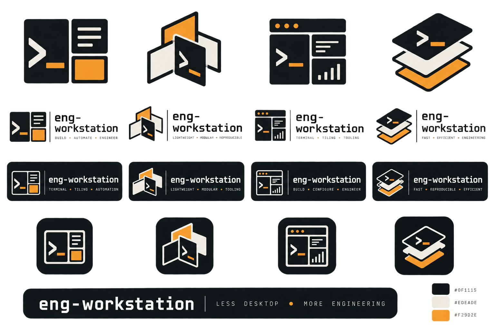
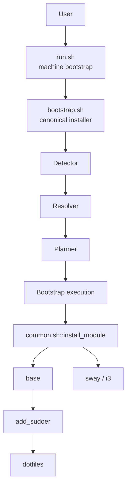

# eng-workstation

> A lightweight, keyboard-driven Debian engineering workbench for humans and AI coding agents.

**Less desktop. More engineering.**

`eng-workstation` is a collection of Bash scripts, configuration and package manifests that turns a fresh Debian installation into a practical engineering workbench.

It is **not an operating system** and it is not a new Linux distribution. Debian stays underneath it. This project simply glues useful tools together, applies sensible configuration and saves you from rebuilding the same workstation by hand.

## Table of Contents

- [What is eng-workstation?](#what-is-eng-workstation)
- [Why does it exist?](#why-does-it-exist)
- [Who is it for?](#who-is-it-for)
- [Why use it?](#why-use-it)
- [What does it install?](#what-does-it-install)
- [How do I use it?](#how-do-i-use-it)
- [What does it support?](#what-does-it-support)
- [How does it work?](#how-does-it-work)
- [Known limitations](#known-limitations)
- [Where do I go next?](#where-do-i-go-next)
- [Project / source](#project--source)
- [License](#license)

## What is eng-workstation?

It is an engineering workstation for engineers.

The focus is a lightweight, terminal-first workflow with tiling window managers such as **Sway** and **i3**:

```text
less mouse
more keyboard
less desktop overhead
more resources for your work
```

The target workloads include:

- AI engineering
- Data engineering
- Software engineering
- DevOps and platform engineering
- Remote development
- General Linux development

The aim is to keep the workstation small enough that RAM, CPU and GPU are available for the thing you actually started the machine for.

On our test machine, a basic Debian environment running this setup was around **700 MB RAM at idle**. That is an observation from our environment, not a universal benchmark.

Every bit of RAM matters. Please use it carefully. Three Chrome tabs can remain somebody else's problem. 

## Why does it exist?

Because rebuilding the same machine is boring.

Every new PC, VM or remote coding session tends to require the same work:

```text
packages
shell
Vim
tmux
dotfiles
plugins
permissions
desktop
configuration
```

The individual tasks are easy. The pile of them is not.

Depending on your experience and the starting environment, manually rebuilding a similar workstation can take several days.

`eng-workstation` captures that setup knowledge in code so it can be reused.

> **Build your engineering workbench once. Reuse it instead of rebuilding it every time.**

## Who is it for?

For humans and AI claw bots.

It is for:

- senior engineers who have better things to do than rebuild their dotfiles
- junior developers who want a practical Linux starting point
- software, data, AI, DevOps and platform engineers
- Linux enthusiasts
- people working with limited hardware
- people using remote development environments
- people who prefer tiling window managers and keyboard-driven workflows
- readers of the engineering setup articles that inspired this project

You do not need the newest hardware.

You do not need TPM 2.0.

You do not need M6 slicon chips

You do not need a NASA workstation to write code. A lof of space missions managed with computers that would be considered hilariously small today.

Calculators and washing machines remain unsupported.

For now.

## Why use it?

Because your workstation should be a tool, not another project. (Mine is become a project, so I sacrifice couple of months my free time for this project, but you do not need for it now)

`eng-workstation` gives you a repeatable engineering environment built from
existing Debian packages and familiar Linux tools.

Instead of spending hours rebuilding:

- your shell
- editor
- terminal workflow
- development tools
- desktop environment

you bootstrap them from one small, auditable project.

## What does it install?

The project installs a practical baseline. The rest is yours.

The exact package manifests are the source of truth.

### Base

Core engineering and command-line tools, including:

Git •  Vim • tmux • Zsh • sudo • curl • wget • ripgrep • fd-find • bat • tree • htop • gpg • direnv • fzf

### Dotfiles

The `dotfiles` module configures:

- Vim
- tmux
- Zsh
- Vim Plug and configured Vim plugins
- TPM and configured tmux plugins

Configuration is applied to the detected normal user, not `root`.

### Desktop

The Sway profile installs a lightweight Wayland desktop stack including Sway, Waybar, Wofi, Foot and related networking, audio and utility packages.

An i3 profile is also provided for lightweight X11 environments.

## How do I use it?

### Recommended: fresh Debian on bare metal

The recommended first installation is a **fresh Debian system on bare metal**.

Run the public bootstrapper:

```bash
wget -qO- adal.page/dev/run.sh | bash
```

The public `run.sh` prepares the machine and hands control to the repository's canonical `bootstrap.sh` installer.

### Debian in a VM

Debian 13 in a VM is useful for testing and development.

The installer can install Sway successfully while the VM still cannot launch a graphical Sway session because suitable 3D/DRM graphics support is unavailable.

### Debian on WSL

WSL is useful for testing and remote workflows. For the full desktop experience, bare metal is recommended.

For a fresh Debian WSL installation, initialise root access first.

From PowerShell:

```powershell
wsl -d debian -u root
passwd root
```

Then inside Debian:

```bash
su -
apt-get update
apt-get upgrade
apt-get install wget
```

Then:

```bash
wget -qO- adal.page/dev/run.sh | bash
```

`wget` is the initial bootstrap prerequisite. Git is installed later by the `base` module, so it does not need to be installed manually for the public bootstrap.

Or you can use it on Ubuntu WSL too partially tested on Ubuntu

### Direct repository use

For development or troubleshooting:

```bash
git clone https://github.com/Eng-ADAL/experimental_linux.git
cd experimental_linux
bash bootstrap.sh --profile sway
```

Legacy desktop aliases are still accepted:

```bash
bash bootstrap.sh --desktop sway
bash bootstrap.sh --desktop i3
```

## What does it support?

`eng-workstation` currently targets Debian.

### Profiles

The resolver currently knows about:

```text
auto
sway
i3
remote-headless
server-light
server-full
```

`auto` uses detected environment facts instead of blindly installing a desktop everywhere.

Examples:

```text
Debian bare metal + recognised graphics
    -> sway

Debian VM without recognised graphics
    -> remote-headless
```

The resolver is deliberately conservative. When the environment cannot be safely identified, it does not silently guess.

### Current verification

The MVP has been exercised through the public bootstrap path on:

- Debian 13 virtual machine
- Debian 13 bare-metal installation
- Debian WSL testing

The strongest validation was a fresh Debian 13 bare-metal installation, including a working Sway graphical session after reboot.

## How does it work?

The installer is intentionally simple Bash glue.



### Detector

Collects facts such as Debian, WSL, WSLg, virtualisation, bare metal and graphics capabilities.

### Resolver

Turns explicit user intent or `auto` into one resolved profile.

### Planner

Turns the resolved profile into a deterministic ordered module plan.

For Sway:

```text
sway
base
dotfiles
sway
```

The first line is the resolved profile. The remaining lines are the execution order.

### Bootstrap

Executes the plan and keeps module stdin isolated from planner input so that a module cannot accidentally consume the next planned module.

### Modules

Modules handle the actual installation/configuration work.

Current modules include:

```text
base
dotfiles
i3
sway
oh-my-zsh
```

`add_sudoer.sh` is account preparation and therefore runs immediately after `base` rather than being part of profile planning.

## Installation modes

### `bootstrap.sh`

The canonical automated installer:

```bash
bash bootstrap.sh --profile auto
bash bootstrap.sh --profile sway
```

### `install.sh`

A small interactive front-end kept for manual workflows and future interactive installation.

Desktop installation is handled by `bootstrap.sh`.

Oh My Zsh is optional and is not part of the core MVP plan.

## Known limitations

This is an MVP, not a finished Linux distribution.

- Debian is the primary supported distribution.
- Fresh installations are recommended.
- Some VMs can install Sway but cannot launch it without suitable 3D/DRM graphics support.
- The current Sway package set still needs some dependency refinement, including Xwayland and `pactl` support.
- The current Vim configuration expects Node.js for `coc.nvim` functionality.
- Some Sway output configuration can be hardware-specific.
- Captured logs may contain ANSI terminal control sequences from terminal-oriented applications such as Vim.
- WSL is useful for testing and remote workflows, but bare metal is the recommended environment for the full desktop experience.
- There is no uninstall workflow yet.

## Logging and diagnostics

The bootstrap reports progress through structured terminal messages such as:

```text
[detector]
[resolver]
[MODULE] Installing: base
[MODULE] Installing: dotfiles
[MODULE] Installing: sway
[base] done
[dotfiles] done
[sway] done
Bootstrap complete.
```

The machine bootstrap keeps an installation log at:

```text
/var/log/eng-workstation/eng-workstation.log
```

For deeper troubleshooting:

```bash
bash scripts/diagnostics.sh
```

The diagnostics script checks useful system, user, graphics, package, dotfile and service information.

Some terminal applications emit ANSI control sequences when their output is captured. A messy log does not automatically mean a failed installation.

## Where do I go next?

The project is deliberately small. The immediate direction is practical rather than a giant roadmap:

- cleaner installation progress and a loading/progress indicator
- better desktop-specific dependency handling
- easier post-install configuration
- cleaner diagnostics and logging
- broader hardware/environment coverage
- packaging, if it proves useful

The core idea stays the same:

> **Save people from rebuilding the same engineering workstation by hand.**

## Project / source

Source repository:

https://github.com/Eng-ADAL/experimental_linux

The public machine bootstrapper lives in the companion `site` repository.

This project exists because we needed it ourselves. We are sharing it because repetitive workstation setup should not consume several days of someone's life.

Use it, modify it, learn from it, or ignore it. The machine is yours. But at least give a second chance your  pre-loved machine 

## License

`eng-workstation` is licensed under the GNU General Public License
version 3 or any later version.

See [LICENSE](LICENSE) for the full licence.
